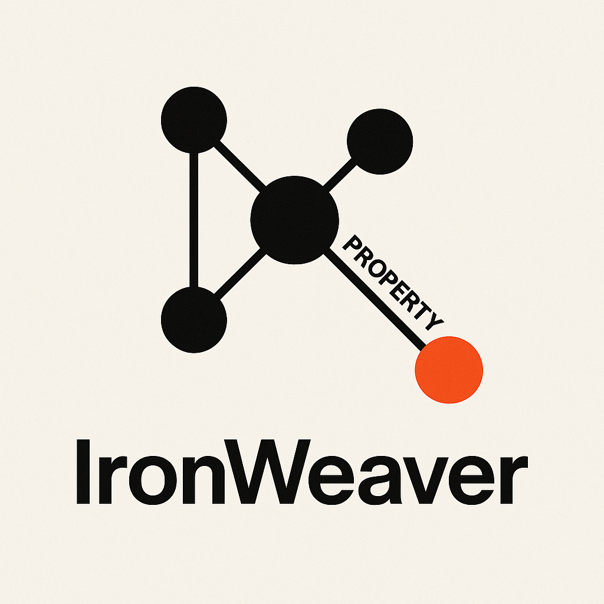

# IronWeaver



A high-performance, Rust-powered Python library for graph data structures and algorithms. Built with PyO3, `IronWeaver` provides fast, memory-efficient graph operations with seamless Python integration.

## 🚀 Features

- **High Performance**: Rust-powered backend for blazing-fast graph operations
- **Rich Graph API**: Intuitive Python interface for creating and manipulating graphs
- **Advanced Algorithms**: BFS, shortest path, graph expansion, and filtering
- **NetworkX Integration**: Seamless conversion to NetworkX for visualization
- **Serialization**: JSON and binary save/load capabilities
- **Event-Driven**: Callback system for node and edge modifications
- **Memory Efficient**: Optimized Rust implementation for large graphs
- **LGF Parsing**: Read Lemon Graph Format files directly from Python

## Installation
Build the package from source to get the latest version:

```bash
pip install maturin
pip install -e .
```

## Quick Start

### Basic Graph Creation

```python
from ironweaver import Vertex, Node, Edge
import networkx as nx
import matplotlib.pyplot as plt

# Create a new graph
graph = Vertex()

# Add nodes with attributes
node1 = graph.add_node('node1', {'value': 1, 'type': 'start'})
node2 = graph.add_node('node2', {'value': 2, 'type': 'process'})
node3 = graph.add_node('node3', {'value': 3, 'type': 'end'})

# Add edges with weights
edge1 = graph.add_edge('node1', 'node2', {'weight': 1.0})
edge2 = graph.add_edge('node2', 'node3', {'weight': 2.0})
edge3 = graph.add_edge('node1', 'node3', {'weight': 3.0})

print(f"Graph: {graph}")
print(f"Node count: {graph.node_count()}")
```

### Graph Visualization

```python
# Convert to NetworkX for visualization
nx_graph = graph.to_networkx()

# Visualize with matplotlib
plt.figure(figsize=(10, 8))
pos = nx.spring_layout(nx_graph)
nx.draw(nx_graph, 
        pos=pos,
        with_labels=True, 
        node_color='lightblue', 
        node_size=1000,
        font_size=12,
        font_weight='bold', 
        edge_color='gray',
        arrows=True)
plt.title("Graph Visualization")
plt.show()
```

## 🔬 Advanced Features

### Shortest Path Finding

```python
# Find shortest path between nodes using BFS
path = graph.shortest_path_bfs('node1', 'node3')
print(f"Shortest path: {path}")

# Visualize the path
path_nx = path.to_networkx()
nx.draw(path_nx, with_labels=True, node_color='orange')
plt.title("Shortest Path from node1 to node3")
plt.show()
```

### Graph Expansion

```python
# Create a subgraph and expand it by exploring neighbors
filtered_graph = graph.filter(ids=['node2'])  # Start with just node2
expanded = filtered_graph.expand(graph, depth=1)  # Expand 1 level

print(f"Original nodes: {graph.keys()}")
print(f"Filtered nodes: {filtered_graph.keys()}")
print(f"Expanded nodes: {expanded.keys()}")
```

### Event-Driven Programming

```python
# Set up callbacks for graph modifications
def on_node_added(vertex, node):
    print(f"Node added: {node.id}")
    # Track visited nodes in metadata
    if "visited_nodes" not in vertex.meta:
        vertex.meta["visited_nodes"] = []
    vertex.meta["visited_nodes"].append(node.id)
    return True  # Continue processing

def on_edge_added(vertex, edge):
    print(f"Edge added: {edge.from_node.id} -> {edge.to_node.id}")
    edge.meta["timestamp"] = "2025-05-25"
    return True

# Register callbacks
graph.on_node_add_callbacks.append(on_node_added)
graph.on_edge_add_callbacks.append(on_edge_added)

# Add nodes and edges - callbacks will be triggered
new_node = graph.add_node('node4', {'value': 4})
new_edge = graph.add_edge('node3', 'node4', {'weight': 1.5})

print(f"Graph metadata: {graph.meta}")
```

### Persistence

```python
# Save graph to JSON
graph.save_to_json("my_graph.json")

# Save to binary format (more efficient for large graphs)
graph.save_to_binary("my_graph.bin")
# Or use half precision floats to reduce file size
graph.save_to_binary_f16("my_graph_f16.bin")

# Load from file
loaded_graph = Vertex.load_from_json("my_graph.json")
print(f"Loaded graph: {loaded_graph}")
print(f"Metadata: {loaded_graph.get_metadata()}")
```

### LGF (Lemon Graph Format) Support

IronWeaver supports reading graphs from the Lemon Graph Format (LGF), which provides a human-readable text format for representing graphs with nodes, edges, and attributes.

```python
from ironweaver import parse_lgf, parse_lgf_file

# Parse LGF from string
lgf_content = """
person_1 Person
  name = "Alice"
  age = 30
  -knows-> person_2
    since = 2020
  -works_at-> company_1

person_2 Person
  name = "Bob"
  age = 25

company_1 Company
  name = "Tech Corp"
  <-founded_by- person_1
"""

graph = parse_lgf(lgf_content)
print(f"Parsed {graph.node_count()} nodes")

# Parse LGF from file
graph = parse_lgf_file("my_graph.lgf")
```

#### LGF Syntax

**Node Declaration:**
```
node_id NodeType
  attribute = "value"
  number_attr = 42
  boolean_attr = true
```

**Edge Declaration (New Syntax):**
```
# Forward relationship: from current node to target
  -relationship_type-> target_node

# Inverse relationship: from target node to current node  
  <-relationship_type- target_node
```

**Supported Data Types:**
- **Strings**: `"quoted text"` or `'quoted text'` 
- **Numbers**: `42`, `3.14`
- **Booleans**: `true`, `false`
- **Unquoted values**: treated as strings

**Import Support:**
```
import("other_file.lgf")
```

See the [LGF Documentation](docs/LGF.md) for detailed syntax and examples.

## API Reference

### Core Classes

#### `Vertex`
The main graph container that holds nodes and provides graph-level operations.

```python
# Create empty graph
graph = Vertex()

# Node operations
node = graph.add_node(id: str, attr: dict = None) -> Node
node = graph.get_node(id: str) -> Node
exists = graph.has_node(id: str) -> bool
count = graph.node_count() -> int

# Edge operations  
edge = graph.add_edge(from_id: str, to_id: str, attr: dict = None) -> Edge

# Algorithms
path = graph.shortest_path_bfs(start: str, end: str, max_depth: int = None) -> Vertex
expanded = graph.expand(source: Vertex, depth: int = 1) -> Vertex
filtered = graph.filter(**filters) -> Vertex  # filters can include 'ids', 'id', or attribute=value pairs

# Conversion and analysis
nx_graph = graph.to_networkx() -> networkx.DiGraph
metadata = graph.get_metadata() -> dict

# Persistence
graph.save_to_json(file_path: str)
graph.save_to_binary(file_path: str)
graph.save_to_binary_f16(file_path: str)
loaded = Vertex.load_from_json(file_path: str) -> Vertex
loaded = Vertex.load_from_binary(file_path: str) -> Vertex
```

#### `Node`
Represents individual vertices in the graph with attributes and edges.

```python
# Access node properties
id = node.id  # Node identifier
attrs = node.attr  # Node attributes dict
edges = node.edges  # List of outgoing edges

# Traversal from node
reachable = node.traverse(depth: int = None) -> Vertex
bfs_result = node.bfs(depth: int = None) -> Vertex
found = node.bfs_search(target_id: str, depth: int = None) -> Node
```

#### `Edge`
Represents connections between nodes with optional attributes.

```python
# Access edge properties
from_node = edge.from_node  # Source node
to_node = edge.to_node      # Target node
attrs = edge.attr           # Edge attributes dict
```

## Performance

`IronWeaver` is built with performance in mind:

- **Rust Backend**: Core algorithms implemented in Rust for maximum speed
- **Memory Efficient**: Optimized data structures for large graphs
- **Minimal Overhead**: PyO3 bindings provide near-native performance
- **Scalable**: Tested with graphs containing thousands of nodes and edges

### Benchmarks

The library includes comprehensive performance testing for various graph operations:
- BFS traversal performance
- Shortest path algorithms
- Graph expansion operations
- Memory usage optimization
- Cyclic graph handling

See the `performance_results/` directory for detailed benchmarks.

## Contributing

Contributions are welcome! Please see our contributing guidelines for more information.

### Development Setup

```bash
# Clone the repository
git clone <repository-url>
cd ironweaver

# Build the Rust extension
maturin develop

# Run tests
pytest
```

## License
Licensed under the MIT License. See the LICENSE file for details.

## Acknowledgments

- Built with [PyO3](https://pyo3.rs/) for Rust-Python bindings
- Compatible with [NetworkX](https://networkx.org/) for visualization
- Inspired by the need for high-performance graph operations in Python

---
**Note**: This library is designed for applications requiring high-performance graph operations. For simple use cases, NetworkX might be more appropriate. For complex, large-scale graph analysis, `IronWeaver` might provide significant performance advantages.
Initially it was developed for the [Gustabor](https://gustabor.de) project.

