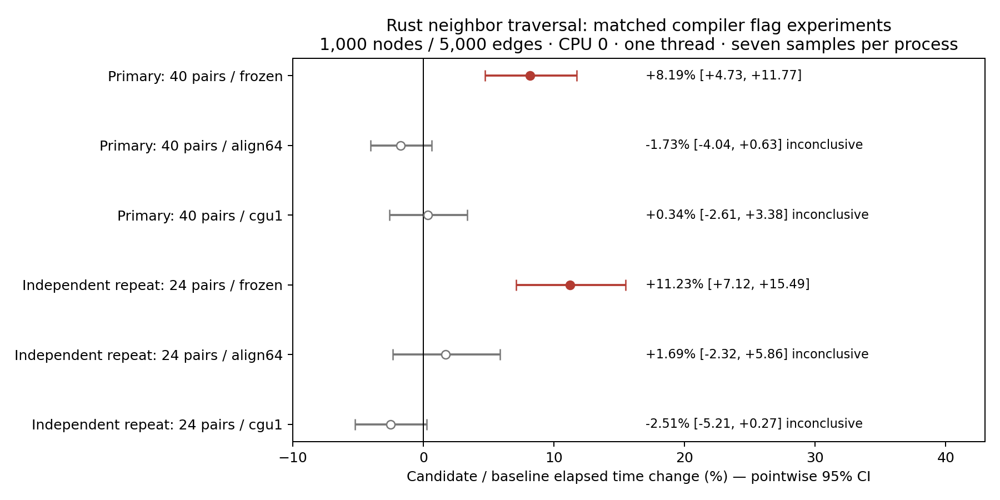

# Neighbor slowdown: code placement investigation, 8 October 2026

The verified original Rust neighbor benchmark still regresses. An alignment intervention removes the statistically resolved revision gap in two independent runs without changing its normalized instructions. This strongly supports a code-placement effect in this executable; it does not establish which instruction-cache or branch-prediction mechanism causes it, or prove equivalence between revisions. Python bindings are not involved.

No production code, dependency, binding or release configuration was changed. No flag is proposed for adoption. The corrected 265-workload screen remains in [the existing report](../construction-2026-10-08/README.md); this is a focused diagnostic addendum, not a replacement full-suite run.

## Controlled measurements

Same boot `b23aef2d-436e-486f-9149-06043aefefc3`, Xeon Platinum 8573C, Rust 1.99.0, dependencies and standard release library compilation as the verified artifacts. Fixed CPU 0; Rayon/OpenMP/BLAS one thread. Each independent process constructs the same 1,000-node/5,000-edge fixture, performs two warmups and seven timed neighbor walks. Construction and destruction are excluded. Process medians form paired log ratios; pointwise 95% Student-t intervals are transformed back to percentages. Positive means slower. Serial exclusive-lock execution, rotated flag order and alternating baseline/candidate order; no overlapping builds/tests/benchmarks. Independent repeats are not pooled.

Baseline source: `c69ef5146c5865f2fd160a2df0a13b968d0255a3`. Frozen candidate production: `4670e49302ad832e6fa9de15ea111f26357445ce`. The original verified construction executables are reused byte for byte; every executable hash and raw sample is archived.

| Example compilation | Primary, 40 pairs: before → after µs | Change [95% CI] | Independent repeat, 24 pairs: change [95% CI] |
|---|---:|---:|---:|
| Frozen standard release | 24.022 → 26.707 | +8.19% [+4.73, +11.77] | +11.23% [+7.12, +15.49] |
| `-C llvm-args=-align-all-functions=6` | 25.738 → 25.341 | −1.73% [−4.04, +0.63], inconclusive | +1.69% [−2.32, +5.86], inconclusive |
| `-C codegen-units=1` | 27.299 → 27.420 | +0.34% [−2.61, +3.38], inconclusive | −2.51% [−5.21, +0.27], inconclusive |

Flags were passed to `cargo rustc --example construction_bench -- ...`, **only to the example**, not to core/dependencies or the Python extension. Both source revisions received each flag. These experiments cannot establish the effect of whole-workspace flags, LTO or Python-wheel configuration.

Absolute flag effects within the primary randomized blocks matter: alignment slows the baseline +4.72% [1.24, 8.32] and speeds the candidate −4.88% [−7.99, −1.67]. Single codegen unit slows the baseline +11.02% [7.18, 14.99]; its candidate effect +2.96% [−0.22, 6.24] is inconclusive. Closing the revision gap is therefore insufficient evidence of a generally useful optimization. Single codegen unit is rejected as a fix for this workload; alignment remains a diagnostic intervention, not a production recommendation.

## Instruction and dependency evidence

`objdump` shows **1,233 identical normalized instructions** in the original benchmark main for the baseline, candidate and removal-only diagnostic reversion. Instruction addresses, relocation addresses/displacements and LLVM anonymous IDs are normalized; mnemonic/register choices, named targets and function-relative branch offsets remain. This is not a claim of byte-identical executables.

| Original main | Start address | Offset modulo 64 |
|---|---:|---:|
| Baseline | `0x47710` | 16 |
| Candidate | `0x47760` | 32 |
| Removal-only diagnostic reversion | `0x47750` | 16 |
| Aligned baseline | `0x486c0` | 0 |
| Aligned candidate | `0x48740` | 0 |

The two aligned mains retain exactly the same normalized instruction hash as the originals: `21de75528815dd04fb379d88296f7e41c277e9454d5dc4d2389f0aae5ab825ad`. Alignment changes placement of other functions too; the experiment does not isolate main alignment from call-target placement. The standalone non-inlined walk is also instruction-identical between revisions and has the same start address. Single codegen unit substantially changes main's generated body (5,037/5,036 normalized instructions), so it is a less specific intervention.

No Cargo manifest or lockfile changes occur between the measured source revisions. `readelf -d` reports the same three dependencies in both original executables: `libc.so.6`, `ld-linux-x86-64.so.2`, `libgcc_s.so.1`. These Rust benchmark processes do not import Python. This supplies no evidence of additional libraries causing the neighbor slowdown. Neighbor iteration does not call the changed edge-ID lookup/removal methods.

Hardware counters were not collected (`perf` is unavailable). Specific cache/predictor explanations remain hypotheses. Runtime address randomization and shared-machine variability are also not fully isolated.

## Separate timing-structure controls

A 2×2 experiment separates combined/standalone benchmark structure from one-walk/128-walk timing batches. The combined diagnostic adds once-per-walk black-box inputs and batching; it is not the unchanged original executable. All four cells use identical fixture generation, assertion, setup exclusion and per-walk normalization, with 24 independent rotated blocks.

| Structure / batch | Before → after µs per walk | Change [95% CI] |
|---|---:|---:|
| Combined / 1 | 24.676 → 24.703 | +0.27% [−6.81, +7.89], inconclusive |
| Combined / 128 | 16.079 → 16.095 | −3.92% [−12.46, +5.45], inconclusive |
| Standalone / 1 | 24.794 → 24.682 | −1.11% [−6.29, +4.35], inconclusive |
| Standalone / 128 | 15.601 → 15.615 | −3.77% [−9.43, +2.24], inconclusive |

Batching substantially changes per-walk timing in both revisions; it measures warmed repeated traversal. These controls support executable/timing sensitivity but do not override the reproducible original regression or prove production workloads unaffected.

## Status and correctness

The original neighbor regression remains explicit and reproducible. The four other corrected-suite signals remain unconfirmed on independent repeats; no claim that every slowdown is fixed. No production remedy is frozen, so no redundant full-suite rerun is justified. Existing 160 Rust tests, six doctests, 834 Python tests, fmt, Clippy and no-PyO3 checks remain applicable to unchanged production. New benchmark result assertions passed in every diagnostic process. Bindings remain unchanged; there is no evidence justifying changing them for this Rust-only symptom.

[Raw samples, frozen binaries, exact diagnostic sources, build commands/logs and disassembly](raw-codegen.zip) · [Absolute flag comparisons](absolute-flags.json) · [Flag assembly metadata](flag-assembly.json)

