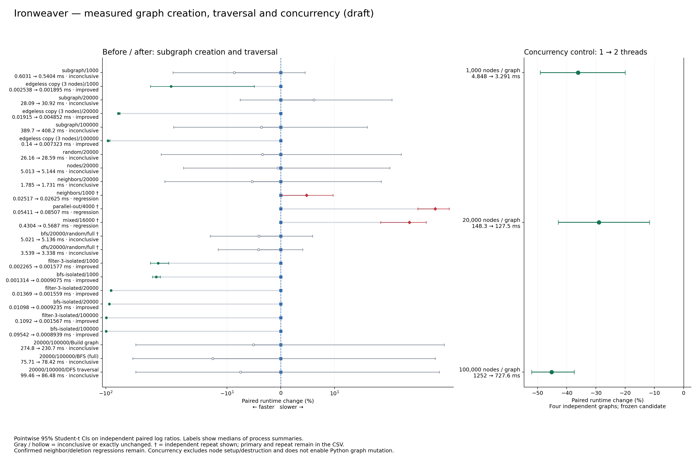
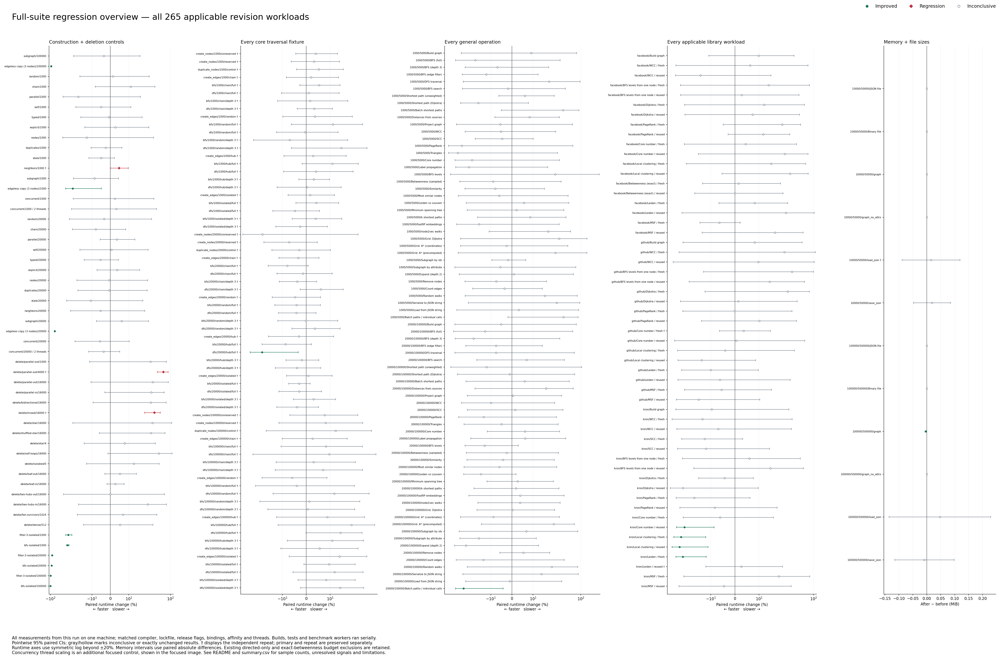

> **SUPERSEDED CORRECTION (8 October):** The original baseline deletion and core traversal executables were stale/misidentified. All results for those two suites, including the claimed large deletion regressions, are invalid. Construction, Python and thread artifacts reproduce. See the [corrected report and root-cause investigation](../construction-2026-10-08/README.md). Original samples are retained for transparency.

# Edgeless subgraph creation: measured performance report

An induced subgraph with no edges now retains the source edge-ID counter without allocating its dense edge-ID table. This avoids allocation and zeroing proportional to the source ID range. The supporting lookup/removal fix keeps sparse IDs accessible when the dense prefix grows over them. Bindings, dependencies and advanced algorithm implementations are unchanged.

**Draft; not ready to merge.** Independent confirmation establishes neighbor iteration and deletion regressions. The edgeless-copy gain is narrow, and ordinary creation/traversal controls remain largely inconclusive.

Baseline `c69ef5146c5865f2fd160a2df0a13b968d0255a3`; frozen candidate `4670e49302ad832e6fa9de15ea111f26357445ce`. All final measurements use these frozen artifacts on this machine. Earlier trials are exploratory evidence, never substituted for final results.

## Focused before / after

Times are medians of independent process summaries (inner medians, or the existing traversal batch average). Percent changes and 95% CIs use paired log ratios; negative means faster. These different summaries need not produce identical arithmetic ratios. Core subgraph timings include destruction of the copied result; source setup and destruction are excluded. Focused Python timings batch 128 unchanged-binding calls and include output destruction/loop overhead, with source setup excluded.

| Workload | Before → after | Paired change [95% CI] | Result |
|---|---:|---:|---|
| subgraph-small/1000/threads=1 | 2.538 µs → 1.895 µs | -21.1% [-34.6, -4.9] | improved (n=10) |
| subgraph-small/20000/threads=1 | 19.15 µs → 4.852 µs | -73.6% [-75.7, -71.2] | improved (n=10) |
| subgraph-small/100000/threads=1 | 140 µs → 7.323 µs | -94.6% [-96.9, -90.6] | improved (n=10) |
| filter-3-isolated/1000 | 2.265 µs → 1.577 µs | -28.7% [-34.6, -22.3] | improved (n=10) |
| filter-3-isolated/20000 | 13.69 µs → 1.559 µs | -88.3% [-89.3, -87.2] | improved (n=10) |
| filter-3-isolated/100000 | 109.2 µs → 1.567 µs | -98.5% [-98.6, -98.4] | improved (n=10) |
| subgraph/20000/threads=1 | 28.09 ms → 30.92 ms | +6.1% [-7.6, +21.9] | inconclusive (n=10) |
| random/20000/threads=1 | 26.16 ms → 28.59 ms | -3.4% [-26.7, +27.3] | inconclusive (n=10) |
| networkx/20000/100000/Build graph | 274.8 ms → 230.7 ms | -5.1% [-48.8, +76.1] | inconclusive (n=6) |
| networkx/20000/100000/BFS (full) | 75.71 ms → 78.42 ms | -12.7% [-52.7, +61.3] | inconclusive (n=6) |
| networkx/20000/100000/DFS traversal | 99.46 ms → 86.48 ms | -7.5% [-48.9, +67.5] | inconclusive (n=6) |

The established gains apply to the measured edgeless-copy fixtures. Full copies, direct node/edge insertion and Python traversals have their own controls and intervals; these narrow core gains do not establish a universal or end-to-end speedup.

## Concurrency

One/two-thread runs alternate within 12 independent process pairs using the frozen candidate. Four independent Rust graphs are prepared outside timing; timed work is edge insertion and Rayon scheduling/result collection. Node setup and graph destruction are excluded. This measures independent-graph edge construction, not shared mutable graphs or Python thread scaling.

| Nodes per graph | One → two threads | Paired change [95% CI] | Result |
|---|---:|---:|---|
| 1,000 | 4.848 ms → 3.291 ms | -36.2% [-49.1, -20.0] | improved |
| 20,000 | 148.3 ms → 127.5 ms | -29.0% [-42.9, -11.7] | improved |
| 100,000 | 1252 ms → 727.6 ms | -45.2% [-52.0, -37.4] | improved |

The unchanged CPython 3.12 bindings acquire the GIL for construction and mutate a graph through exclusive access. No automatic parallel mutation was introduced. Independent pure-Rust graphs can use separate workers; the figures above describe only this measured control.

## Complete suite and independent regression checks

All 265 applicable revision workloads were measured: construction=30, traversal=69, deletion=17, python-focus=6, networkx=76, libraries=55, memory=12. Thread scaling adds three controls. All retained raw samples, including unfavorable and inconclusive runs, remain available.
Primary sampling: ten construction pairs (seven inner samples, two warmups); six core traversal pairs (one warmup, existing ≥100 ms/minimum-three-call batches); six deletion pairs (three samples, three warmups, existing batch sizes); ten focused Python binding pairs (seven batches of 128 calls, two warmups); six broad-suite pairs (three samples plus one warmup). Facebook exact betweenness retains one timed call/process and no added warmup. Existing directed-only restrictions and the nodes×edges budget are retained, with exclusions recorded in the suite JSON.

Every primary interval wholly above zero is an independent-repeat signal, regardless of its size. Signals receive 12 new process pairs with matching artifacts, affinity, threads, inputs, timed operations, warmups and inner sample counts. Targeted general-operation repeats execute untimed references and other required operations once; selected operations retain the original timing protocol. Library repeats retain fresh/reused result checks and selected operations; memory repeats retain fresh-process workers and peak resets. Nonselected setup/context differs from the complete screen and is explicitly separate. The core traversal confirmation repeats the entire fixture process to retain its setup context. No primary/repeat observations are pooled.

The PR remains a draft. Primary signals are retained explicitly; a repeat interval crossing zero does not establish equivalence or prove the earlier observation resolved.

| Workload | Primary change [95% CI] | Independent repeat [95% CI] | Outcome |
|---|---:|---:|---|
| neighbors/1000/threads=1 | +9.2% [+2.2, +16.8] | +4.8% [+0.1, +9.7] | confirmed regression |
| dfs/1000/hub/Some(3) | +19.9% [+2.9, +39.6] | +0.3% [-12.2, +14.6] | unconfirmed / unresolved signal |
| bfs/1000/isolated/None | +16.6% [+1.0, +34.5] | +4.2% [-4.4, +13.6] | unconfirmed / unresolved signal |
| dfs/20000/hub/None | +25.3% [+3.7, +51.4] | -18.5% [-31.3, -3.3] | unconfirmed / unresolved signal |
| dfs/20000/isolated/Some(3) | +18.9% [+1.0, +40.0] | -4.0% [-12.3, +5.2] | unconfirmed / unresolved signal |
| dfs/100000/random/None | +42.0% [+7.3, +87.7] | +11.8% [-13.9, +45.1] | unconfirmed / unresolved signal |
| parallel-out/4000 | +38.1% [+0.4, +90.0] | +61.4% [+40.4, +85.5] | confirmed regression |
| mixed/16000 | +38.4% [+15.6, +65.6] | +33.1% [+18.6, +49.4] | confirmed regression |
| libraries/github/Core number / fresh | +23.4% [+4.2, +46.1] | +3.6% [-6.4, +14.7] | unconfirmed / unresolved signal |
| libraries/kron/Communities (Leiden / Louvain) / reused | +29.2% [+7.5, +55.4] | +2.6% [-12.0, +19.7] | unconfirmed / unresolved signal |
| memory/10000/50000/load_json | +0.2% [+0.1, +0.4] | +0.0% [-0.1, +0.2] | unconfirmed / unresolved signal |

## Side effects and correctness

- An edgeless result avoids approximately `4 × source.next_edge_id` retained bytes when the prior dense reservation applied: 20,000 / 400,000 / 2,000,000 bytes in the three focused source sizes. No extra remapping array or worker pool is added to production code.
- Nonempty subgraphs still use the existing source-sized reservation; optimizing those is outside this frozen implementation. Empty dense cells now consult the sparse edge-ID index, which can add lookup work; all insertion/deletion controls are included above and in the complete CSV.
- The correctness test covers retained labels/counter, subsequent generated and explicit IDs, duplicate detection, a sparse ID covered by dense growth, removal, heap counters and an unchanged source graph.
- Final correctness: 834 Python tests, 160 Rust tests and 6 doctests passed. Formatting, Clippy for the workspace/all targets with warnings denied, and the no-PyO3 core dependency check passed. Original NetworkX benchmark assertions and applicable fresh/reused-library checks completed.
- Confidence intervals are nominal, pointwise 95% Student-t intervals on independent paired log ratios; inner repetitions are not independent observations. The memory plot uses paired absolute-difference intervals. Screening many workloads requires confirmation and does not provide simultaneous confidence guarantees. Shared-VM variation and artifact/code-layout effects remain possible; unrelated algorithm fluctuations are not claimed as implementation gains.

## Protocol and provenance

- Rust 1.99.0; Python 3.12.14; Intel Xeon Platinum 8573C; Linux x86-64. CPU quota `200000 100000` (two CPU equivalents). Sequential controls use CPU 0 / one thread; broad and two-thread controls use CPUs 0–1 / two threads. Each revision has matching affinity and thread counts within each comparison.
- Standard release builds, copied Cargo.lock, same Python interpreter/dependencies and empty RUSTFLAGS. BLAS/OpenMP one thread; Python hash seed 42. Workers, builds and tests run serially under an exclusive benchmark lock. Linux memory workers reset only their own peak-RSS counters through `/proc/self/clear_refs` with the required execution access.
- Lockfile SHA-256: `8a88c8fe93618bb1741941a80608c7a75c627ed2fe60d2b70b25d7cd6272623a`.
- Unchanged binding-source SHA-256: `15fe90b64270e336d85f27f084c9b3c433b20702cfec402142615176cba59195`.
- Candidate graph.rs SHA-256: `5c4813eba4d45d24e7970552fcc4d3d741f3ca72c52c204f6c08604a6a795207`.
- Final extensions and core binaries were frozen and hashed before measurements. A shared-target stale extension was detected before timing and rebuilt; archive source timestamps are now refreshed by the builder. Final manifests and each broad worker record extension hashes and runtime identity.
- Existing environment/toolchain/dependency caches and benchmark harnesses were reused. Ignored prior frozen binaries/data were absent in this environment, so artifacts were built and datasets frozen once. Previous reports informed rejection of the node-ID entry experiment; historical timings are not final baselines.
- Endpoint-lookup and dense-remap candidates were rejected. Completed exploratory/dense trial samples are preserved separately. The interrupted final-size thread control of the rejected dense candidate lacked a complete checkpoint and is excluded; no incomplete trial is used for a final estimate. An initial broad-suite launcher ended before saving a complete paired estimate; its log is retained and excluded. The persistent controller saves each completed worker and pair. Final estimates use only completed independent pairs.

## Deliverables

[Focused PNG](focused-comparison.png) · [Full-suite PNG](suite-regression-overview.png) · [All primary/repeat CIs](summary.csv) · [Raw samples, frozen artifacts/data and logs](raw-samples.zip)

Gray/hollow marks inconclusive or exactly unchanged results. A dagger shows an independent repeat; both observations remain in the CSV. Primary signals prompted the complete traversal-context confirmation.
