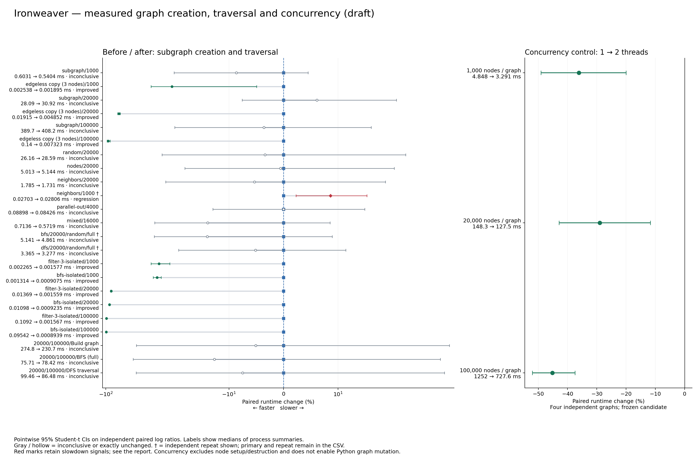
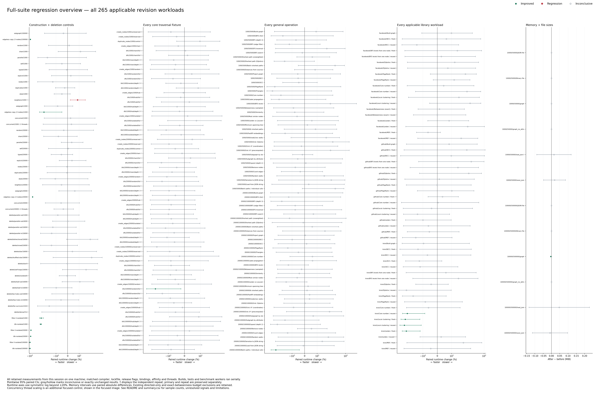

# Corrected baseline comparison and regression diagnosis — 8 October 2026

**This supersedes the 7 October deletion and core traversal results.** Those suites used misidentified baseline executables and cannot establish a regression against `c69ef51`. Their samples remain archived as invalid evidence. Construction, Python and thread controls were independently validated and remain usable. Production code and bindings are unchanged. The PR remains a draft; the neighbor signal and other unresolved intervals must not be presented as resolved.

## Cause of the large apparent deletion regressions

The final manual rebuild (`work/construction/build-final.sh`) refreshed only baseline `construction_bench`; it left `bench_remove_node` and `traversal_bench` from an earlier build. The manifest recorded the intended source hash but did not prove that every executable was built from that source. Consequently, the earlier claim of fully matched baseline artifacts was wrong. The exact origin of the two stale executables is not established.

A fresh build of the exact baseline reproduces the construction executable byte for byte, but not the other two. Fresh candidate builds reproduce all three original candidate hashes. The baseline Python extension also reproduces byte for byte, validating reuse of its 143 broad-suite metrics and six focused calls. The same boot, Rust 1.99.0, lockfile, Python 3.12.14, release flags, CPU affinity and thread counts are retained.

| Baseline artifact | Earlier SHA-256 | Verified SHA-256 |
|---|---|---|
| construction_bench | `5035042ccdaafa27507a14339968cf28bd9544e953c6f995a5e0e2b06d2f4cd6` | `5035042ccdaafa27507a14339968cf28bd9544e953c6f995a5e0e2b06d2f4cd6` |
| bench_remove_node | `81685930329bac81daa61b816c519f16a6b2d62934022a2d74cce85dc2bbd1d0` | `7be227e931935e635be6ce1d0ecaacdb4afde3da5ec830d8c7bea3a0b4ebd421` |
| traversal_bench | `c33d0ed080a61d8103862ae96c7cce5e6388e374b4d486fb228ee6d939a0023a` | `44e4f36fe3886f3a589a608ffc51e0f3b2fa57e204bc0c4bdd28700ebc4da340` |

Isolated diagnostic reversions of the edge-ID lookup and removal changes did not recover deletion performance when compared with the misidentified executable. Rebuilding the unchanged baseline itself produced the large apparent loss. With the verified baseline, the direct 24-pair deletion comparisons are inconclusive. This supports an artifact mismatch as the cause of the prior claim; it does not identify a production deletion defect. The unsafe reversion variants are never proposed for merging.

## Corrected measured results

Times are medians of independent process summaries. Percent changes and nominal pointwise 95% CIs use paired log ratios; negative means faster. These summaries need not give identical arithmetic ratios. Primary and independent repeats are never pooled.

| Workload | Verified before → after | Paired change [95% CI] | Status |
|---|---:|---:|---|
| parallel-out/4000 | 88.98 → 84.26 µs | +0.02% [-12.93, +14.90] | inconclusive; n=12 |
| mixed/16000 | 713.6 → 571.9 µs | -13.91% [-31.73, +8.55] | inconclusive; n=12 |
| neighbors/1000/threads=1 | 27.03 → 28.06 µs | +8.62% [+2.32, +15.30] | regression; n=40 |
| subgraph-small/20000/threads=1 | 19.15 → 4.852 µs | -73.57% [-75.72, -71.23] | improved; n=10 |
| filter-3-isolated/100000 | 109.2 → 1.567 µs | -98.53% [-98.64, -98.40] | improved; n=10 |

## The smaller neighbor slowdown

The original neighbor control traverses adjacency lists and validates edge handles; it never calls the changed edge-ID lookup/removal methods. Its latest 40-pair confirmation is retained above. One scratch variant that changes only edge-ID removal reverses the neighbor-control interval. That removal code is never executed in this fixture; the changed executable therefore supplies a generated-code/context control. This was not a negative run of the identical candidate binary. The unsafe variant is not a proposed fix.

A second control isolates the same deterministic random graph, direction and count expression in a non-inlined walk function. It batches 128 walks/sample, with setup/destruction excluded, two warmups and seven measured samples. Both revisions use the same control. This deliberately changes code-generation and timing context: it is a diagnostic, not a substitute for the original benchmark.

| Standalone walk | Before → after | Paired change [95% CI] | Status |
|---|---:|---:|---|
| neighbors/1000/threads=1 | 15.07 → 15.65 µs | -0.08% [-5.95, +6.14] | inconclusive; n=24 |
| neighbors/20000/threads=1 | 1361 → 1360 µs | +0.96% [-3.21, +5.30] | inconclusive; n=24 |

Direct candidate → removal-reversion control (same original timing protocol, n=40): 27.06 → 24.11 µs, -12.51% [-15.39, -9.53]. The reversion changes code that is never executed in this fixture.

The standalone evidence limits attribution: there is no added edge-ID work in the walking path. The remaining original-control signal is sensitive to generated-code/timing context; its precise microarchitectural cause is not established. It remains unresolved rather than being labelled a harmless false positive.

## Complete inventory and remaining signals

All 265 applicable workloads remain represented. All 17 deletion and 69 core traversal fixtures were remeasured using verified artifacts in 12 new independent serial pairs, with the original warmups, inner samples and affinity. Construction, unchanged-binding, broad-suite and thread data are reused only where their artifact hashes reproduce. Original invalid deletion/traversal samples and repeats are excluded from every corrected estimate. The broad exact-betweenness and directed/budget exclusions remain unchanged.

A new positive core interval triggered an independent repeat of the entire 69-fixture traversal process, retaining its setup context. Existing valid library/memory confirmations are retained separately. New repeat-only positive intervals, if any, remain explicit.

| Workload | Primary CI | Independent repeat CI | Interpretation |
|---|---:|---:|---|
| neighbors/1000/threads=1 | +9.25% [+2.16, +16.83] | +8.62% [+2.32, +15.30] | confirmed slowdown |
| dfs/100000/hub/Some(3) | +26.67% [+3.95, +54.35] | -5.35% [-24.07, +17.99] | unresolved / unconfirmed signal |
| libraries/github/Core number / fresh | +23.42% [+4.23, +46.13] | +3.62% [-6.42, +14.73] | unresolved / unconfirmed signal |
| libraries/kron/Communities (Leiden / Louvain) / reused | +29.24% [+7.51, +55.36] | +2.64% [-12.00, +19.72] | unresolved / unconfirmed signal |
| memory/10000/50000/load_json | +0.23% [+0.09, +0.36] | +0.02% [-0.13, +0.18] | unresolved / unconfirmed signal |

## Safeguards, correctness and limits

- The builder now cleans only the core package’s release artifacts/examples before freezing a revision, retaining dependency caches. It records the resolved revision, each executable hash and each benchmark-source hash. All three examples are built/copied together; partial refreshes must not be used as frozen pairs. The changed shell script passes syntax validation.
- Production graph code, dependencies and bindings are unchanged from the frozen candidate. The prior 834 Python tests, 160 Rust tests, six doctests, formatting, Clippy and no-PyO3 check therefore remain applicable; no redundant correctness suite was rerun. Benchmark result assertions execute on each new process.
- The edgeless-copy change still preserves IDs and avoids the source-sized table; nonempty copies retain their existing reservation. No Python concurrency was added. Existing independent-Rust-graph scaling results remain valid because the candidate binary reproduces.
- CIs are pointwise, not simultaneous. Shared-machine timing variation remains possible. Inconclusive intervals do not establish equivalence, and unrelated algorithm gains are not attributed to this source change.

## Reproducibility files

[All corrected CIs](summary.csv) · [Diagnosis experiments](diagnosis-summary.json) · [Provenance](provenance.json) · [Raw samples, verified executables, diagnostic sources and original invalid archive](raw-samples.zip)

Hollow gray marks are inconclusive. A dagger displays an independent repeat; primary and repeat remain separate in the CSV.
