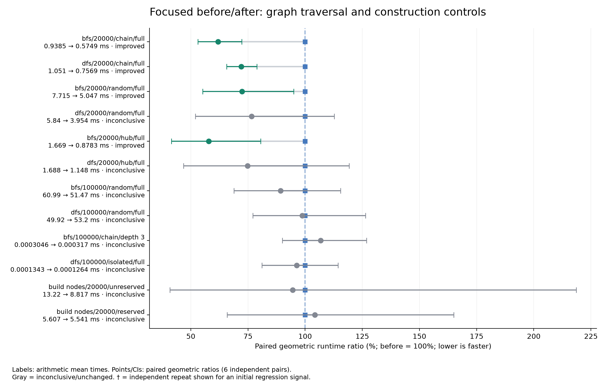
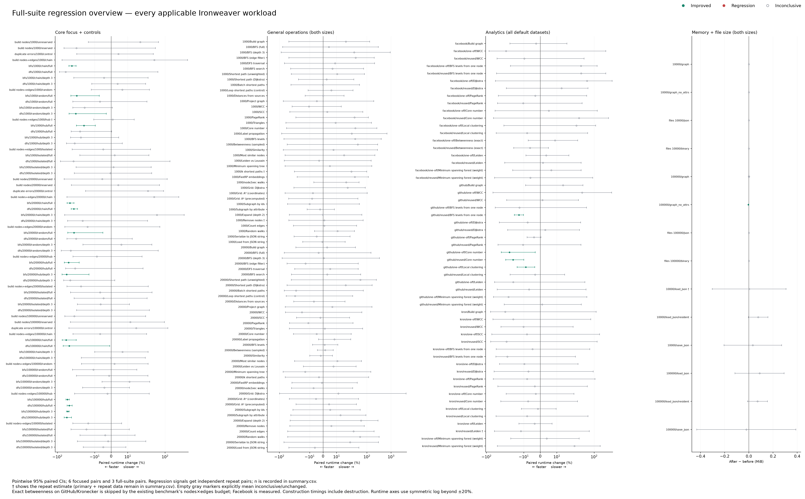

# Adaptive core BFS/DFS: performance report

Core traversal now switches from a handle hash set to a slot bitmap after the reached set justifies initialization. Small searches keep hashing. No bindings, API, graph-creation or serialization implementation changed.

All 214 applicable workloads/controls were measured on the same machine using frozen artifacts, matched Rust 1.99.0/release settings/dependencies, CPUs 0–1 and two threads. Primary sampling uses six independent focused pairs and three full-suite pairs. Every primary regression signal received independent repeat pairs. See [protocol](protocol.md) for scope, inputs, formulas, flags and measurement limitations.

## Selected before/after results

Negative changes mean faster. CIs are pointwise paired 95% Student-t intervals on log runtime ratios; timings are arithmetic means. Core rows use `Graph<(), ()>` and exclude Python conversion/cancellation-hook overhead. End-to-end rows exercise the unchanged bindings.

| Workload | Before → after | Paired change [95% CI] | Result |
|---|---:|---:|---|
| bfs/20000/chain/None | 0.938 → 0.575 ms | -38.1% [-46.9, -27.8] | improved (n=6) |
| dfs/20000/chain/None | 1.051 → 0.757 ms | -28.0% [-34.3, -21.1] | improved (n=6) |
| bfs/20000/random/None | 7.715 → 5.047 ms | -27.6% [-44.8, -5.0] | improved (n=6) |
| bfs/20000/hub/None | 1.669 → 0.878 ms | -42.2% [-58.5, -19.4] | improved (n=6) |
| dfs/20000/random/None | 5.840 → 3.954 ms | -23.5% [-48.0, +12.7] | inconclusive (n=6) |
| dfs/20000/hub/None | 1.688 → 1.148 ms | -25.2% [-53.1, +19.3] | inconclusive (n=6) |
| networkx/20000/BFS (full) | 59.056 → 57.799 ms | -3.4% [-62.3, +147.8] | inconclusive (n=3) |
| networkx/20000/DFS traversal | 62.266 → 66.520 ms | +5.2% [-23.1, +43.9] | inconclusive (n=3) |
| networkx/20000/Build graph | 189.223 → 194.955 ms | +2.9% [-20.6, +33.4] | inconclusive (n=3) |
| create_nodes/20000/false | 13.218 → 8.817 ms | -5.5% [-59.1, +118.6] | inconclusive (n=6) |
| create_nodes/20000/true | 5.607 → 5.541 ms | +4.2% [-34.1, +65.0] | inconclusive (n=6) |

The focused core gains are established for these measured cases. End-to-end Python traversal and construction results remain inconclusive; the core results do not establish the same percentage improvement for the Python API. Large random-graph DFS is also inconclusive.

## Unresolved observations after independent repeat

Five primary intervals indicated regressions. All five independent repeat intervals overlap zero. None is confirmed, and none is declared resolved: these are explicit unconfirmed observations. The PR remains a draft. Primary/repeat samples and estimates are separate, without pooling or dropping noisy runs.

| Workload | Primary before → after | Primary change [95% CI] | Repeat before → after | Repeat change [95% CI] |
|---|---:|---:|---:|---:|
| create_edges/1000/hub | 0.382 → 0.416 ms | +8.0% [+0.7, +15.8] | 0.351 → 0.352 ms | +0.9% [-10.6, +13.9] (inconclusive) |
| libraries/kron/reused/Communities (Leiden / Louvain) | 732.240 → 767.815 ms | +4.9% [+1.3, +8.6] | 903.212 → 781.958 ms | -11.8% [-54.0, +69.0] (inconclusive) |
| memory/10000/load_json | 67.072 → 67.172 MiB | +0.149% [+0.048, +0.251] | 67.113 → 67.116 MiB | +0.004% [-0.450, +0.460] (inconclusive) |
| networkx/1000/k shortest paths | 20.594 → 23.955 ms | +16.3% [+9.4, +23.5] | 20.366 → 25.496 ms | +22.9% [-23.6, +97.9] (inconclusive) |
| networkx/1000/Remove nodes | 0.178 → 0.214 ms | +20.4% [+3.3, +40.2] | 0.205 → 0.206 ms | +0.9% [-40.2, +70.0] (inconclusive) |

The 10,000-node JSON-load peak signal was initially +102.7 KiB [+32.9, +172.5]; the independent repeat is +2.7 KiB [-310.0, +315.4].

## Side effects and correctness

- After promotion, the bitmap payload uses one bit per arena slot (2,504 bytes at 20,000 slots). The initial hash table briefly coexists with the bitmap during conversion, then is freed. This is temporary traversal scratch storage; output vectors/DFS stacks remain in addition. Sparse/shallow searches avoid immediate arena-sized allocation.
- Graph resident-memory controls are unchanged or tiny/inconclusive; the 100,000-node structure-only resident estimate is 4 KiB lower. JSON and binary file sizes match exactly in every paired run. All serialization-peak results are included in the CSV and overview.
- Python: 830 tests passed. Rust: 148 core tests and 3 doctests passed. Formatting, Clippy (all targets; warnings denied), and the no-PyO3 core-dependency check passed. Existing benchmark result assertions passed.
- Regression uncertainty is retained; no merge or claim of universal/end-to-end speedup is made.

## Plots and complete evidence

[Focused PNG](focused-comparison.png) · [Full-suite PNG](suite-regression-overview.png) · [All results with primary/repeat CIs](summary.csv) · [Raw samples, metadata and logs](raw-samples.zip) · [Measurement protocol](protocol.md)

Gray markers explicitly identify inconclusive/unchanged results. A dagger marks an initial regression signal whose independent repeat is displayed; both intervals remain in the CSV. The overview keeps all CIs and uses a symmetric-log runtime axis outside ±20%.

Artifacts and frozen inputs remain available in the reused environment under `work/artifacts` and `work/data`; their hashes and build/runtime details are in the archive. The archive contains every raw final/exploratory observation, test logs, the exact Cargo.lock and orchestration settings.
